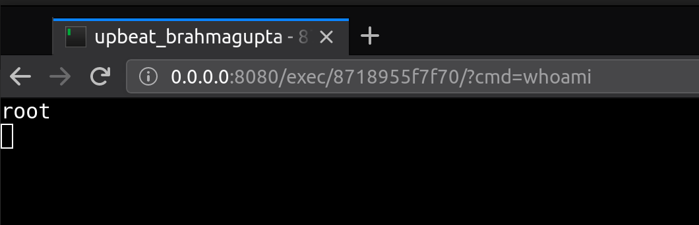
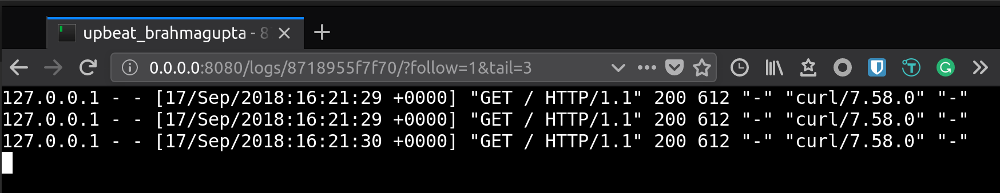

# Container web TTY

[](https://goreportcard.com/report/github.com/wrfly/container-web-tty)
[](https://travis-ci.org/wrfly/container-web-tty)
[](https://godoc.org/github.com/wrfly/container-web-tty)
[](https://github.com/wrfly/container-web-tty/blob/master/LICENSE)
[](https://hub.docker.com/r/wrfly/container-web-tty)
[](https://hub.docker.com/r/wrfly/container-web-tty)
[](https://github.com/wrfly/container-web-tty/releases)
[](https://github.com/wrfly/container-web-tty/releases)

[中文](README.ZH.md)

Tired of typing `docker ps | grep xxx` && `docker exec -ti xxxx sh` ? Try me!

Although I like terminal, I still want a better tool to get into the containers to do some debugging or checking.
So I build this `container-web-tty`. It can help you get into the container and execute commands via a web-tty,
based on [yudai/gotty](https://github.com/yudai/gotty) with some changes.

Both `docker` and `kubectl` are supported.

## Usage

Of cause you can run it by downloading the binary, but thare are some
`Copy-and-Paste` ways.

### Using docker

You can start `container-web-tty` inside a container by mounting `docker.sock`:

```bash
docker run -dti --restart always --name container-web-tty \
    -p 8080:8080 \
    -v /var/run/docker.sock:/var/run/docker.sock \
    wrfly/container-web-tty

# tail logs
docker logs -f container-web-tty
```

### Using kubernetes

Or you can mount the kubernetes config file:

```bash
docker run -dti --restart always --name container-web-tty \
    -p 8080:8080 \
    -e WEB_TTY_BACKEND=kube \
    -e WEB_TTY_KUBE_CONFIG=/kube.config \
    -v ~/.kube/config:/kube.config \
    wrfly/container-web-tty
```

### Using local <-> remote (gRPC)

You can deploy `container-web-tty` in remote servers, and connect
to it via a local `container-web-tty`. They use gRPC for communication.

This is useful when you cannot get the remote servers or there are more
than one server that you need to connect to.

#### Remote

Host `192.168.66.1` and `192.168.66.2` both running:

```bash
docker run -dti --restart always --name container-web-tty \
    -p 8080:8080 \
    -p 8090:8090 \
    -e WEB_TTY_GRPC_PORT=8090 \
    -e WEB_TTY_GRPC_AUTH=96ssW0rd \
    -v /var/run/docker.sock:/var/run/docker.sock \
    wrfly/container-web-tty
```

Notes:

- You can disable the HTTP server by setting `WEB_TTY_PORT=-1`
- The `WEB_TTY_GRPC_AUTH` must be the same between all hosts

#### Local

```bash
docker run -dti --restart always --name container-web-tty \
    -p 8080:8080 \
    -e WEB_TTY_BACKEND=grpc \
    -e WEB_TTY_GRPC_AUTH=96ssW0rd \
    -e WEB_TTY_GRPC_SERVERS=192.168.66.1:8090,192.168.66.2:8090 \
    wrfly/container-web-tty
```

Now you will see all the containers of all the servers via *<http://localhost:8080>*

## Keyboard Shortcuts (Linux)

- Cut the word before the cursor `Ctrl+w` => **You cannot do it for now** (I'll working on it for `Ctrl+Backspace`, but I know little about js)
- Copy:  `Ctrl+Shift+c` => `Ctrl+Insert`
- Paste: `Ctrl+Shift+v` => `Shift+Insert`

## Features

- [x] it works
- [x] docker backend
- [x] kubectl backend
- [x] beautiful index
- [x] support `docker ps` options
- [x] start|stop|restart container(docker backend only)
- [x] proxy mode (client -> server's containers)
- [x] auth(only in proxy mode)
- [x] TTY timeout (idle timeout)
- [x] history audit (just `cat` the history logs after enable this feature)
- [x] real time sharing (like screen sharing)
- [x] container logs (click the container name)
- [x] exec arguments (append an extra "?cmd=xxx" argument in URL)
- [x] connect to gRPC servers via HTTP/Socks5 proxy

### Audit exec history and container outputs

```bash
docker run -dti --restart always --name container-web-tty \
    -p 8080:8080 \
    -e WEB_TTY_AUDIT=true \
    -v `pwd`/container-audit:/audit \
    -v /var/run/docker.sock:/var/run/docker.sock \
    wrfly/container-web-tty
```

After you exec some commands, you will see the inputs and outputs under the
`container-audit` directory, you can use `cat` or `tail -f` to see the changes.

### Real-time sharing

```bash
docker run -dti --restart always --name container-web-tty \
    -p 8080:8080 \
    -e WEB_TTY_SHARE=true \
    -v /var/run/docker.sock:/var/run/docker.sock \
    wrfly/container-web-tty
```

By enabling this feature, you can share the container's inputs and outputs
with others via the share link (click the container's image to get the link).

#### Collaborate

```bash
docker run -dti --restart always --name container-web-tty \
    -p 8080:8080 \
    -e WEB_TTY_SHARE=true \
    -e WEB_TTY_COLLABORATE=true \
    -v /var/run/docker.sock:/var/run/docker.sock \
    wrfly/container-web-tty
```

By enabling this feature, once you exec into the container, you can share your
process with others, that means anyone got the shareable link would type the command
to the tty you are working on. You can edit the same file, type the same code, in the
same TTY! (P.S. Only the first exec process would be shared to others)

## Options

```txt
GLOBAL OPTIONS:
   --addr value                 server binding address (default: "0.0.0.0")
   --audit-dir value            container audit log dir path (default: "audit")
   --backend value, -b value    backend type, 'docker' or 'kube' or 'grpc'(remote) (default: "docker")
   --control-all, --ctl-a       enable container control (default: false)
   --control-restart, --ctl-r   enable container restart (default: false)
   --control-start, --ctl-s     enable container start   (default: false)
   --control-stop, --ctl-t      enable container stop    (default: false)
   --debug, -d                  debug mode (log-level=debug enable pprof) (default: false)
   --docker-host value          docker host path (default: "/var/run/docker.sock")
   --docker-ps value            docker ps options
   --enable-audit, --audit      enable audit the container outputs (default: false)
   --enable-collaborate, --clb  shared terminal can write to the same TTY (default: false)
   --enable-share, --share      enable share the container's terminal (default: false)
   --grpc-auth value            grpc auth token (default: "password")
   --grpc-port value            grpc server port, -1 for disable the grpc server (default: -1)
   --grpc-proxy value           grpc proxy address, in the format of http://127.0.0.1:8080 or socks5://127.0.0.1:1080
   --grpc-servers value         upstream servers, for proxy mode(grpc address and port), use comma for split
   --help, -h                   show help (default: false)
   --idle-time value            time out of an idle connection
   --kube-config value          kube config path (default: "/home/mr/.kube/config")
   --port value, -p value       HTTP server port, -1 for disable the HTTP server (default: 8080)
   --version, -v                print the version (default: false)
```

## Show-off

List the containers on your machine:


It will execute `/bin/sh` if there is no `/bin/bash` inside the container:


`/bin/bash`:


Run custom command:



Get container logs:

