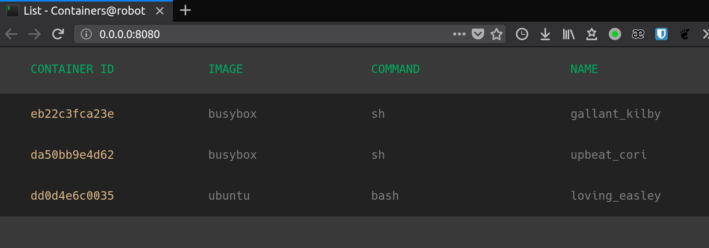
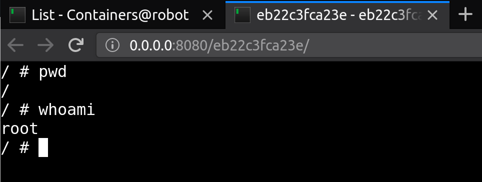
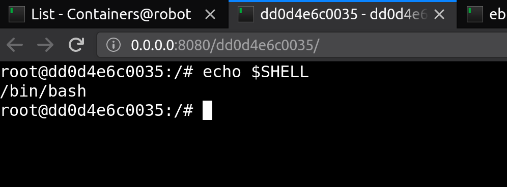

# Container web TTY

[](https://goreportcard.com/report/github.com/wrfly/container-web-tty)
[](https://travis-ci.org/wrfly/container-web-tty)
[](https://godoc.org/github.com/wrfly/container-web-tty)
[](https://github.com/wrfly/container-web-tty/blob/master/LICENSE)
[](https://hub.docker.com/r/wrfly/container-web-tty/)

Tired of typing `docker ps | grep xxx` && `docker exec -ti xxxx sh` ? Try me!

Although I like terminal, I still want a better tool to get into the containers to do some debugging or checking.
So I build this `container-web-tty`. It can help you get into the container and execute commands via a web-tty,
based on [yudai/gotty](https://github.com/yudai/gotty) with some changes.

Both `docker` and `kubectl` are supported.

## Usage

For docker:

```bash
docker run --rm -ti --name web-tty \
    -p 8080:8080 \
    -v /usr/bin/docker:/usr/bin/docker \
    -v /var/run/docker.sock:/var/run/docker.sock \
    wrfly/container-web-tty
```

## Features

- [x] it works
- [x] docker backend
- [x] kubectl backend
- [x] beautiful index
- [x] environment injection(extra params)
- [ ] proxy mode(client -> server's containers)
- [ ] auth
- [ ] TTY timeout

## Show-off

List the containers on your machine:



It will execute `/bin/sh` if there is no `/bin/bash` inside the container:



`/bin/bash`:

